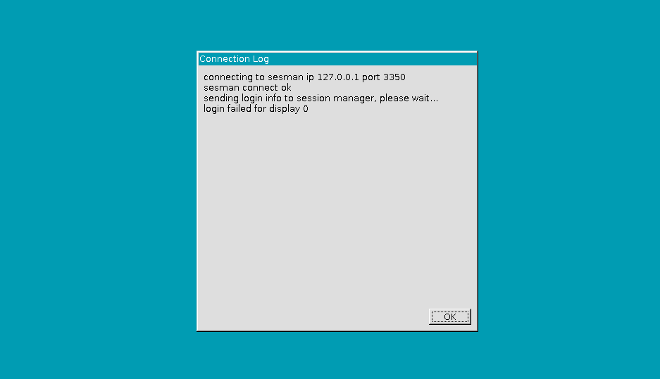

# 一、VNC与XRDP

> 为什么推荐你是用XRDP而不是VNC ?

# 二、在Linux上安装

在安装VNC和XRDP之前, 需要进行一些前置工作, 包括SELinux、Firewalld、SSHD。首先关闭SELinux, 修改`/etc/selinux/config`文件:

```ini
target=disabled
```

然后禁用Firewalld:

```bash
sudo systemctl stop firewalld && systemctl disable firewalld
```

确保SSHD支持用户名密码登录, 需要修改`/etc/ssh/sshd_config`

```ini
Port 22
Protocol 2
PermitRootLogin yes
PubkeyAuthentication yes
AuthorizedKeysFile .ssh/authorized_keys
PasswordAuthentication yes
PermitEmptyPasswords no
ChallengeResponseAuthentication no
UsePAM no
UseDNS no
```

Ubuntu直接安装VNC和XRDP即可, CentOS用户需要启用epel源:

```bash
sudo yum install epel* -y
sudo yum clean all
sudo yum makecache
```

Ubuntu使用如下命令安装: 

```bash
sudo apt install xrdp gnome xface4 vnc4server -y
```

CentOS使用如下命令安装:

```bash
sudo yum --enablerepo=epel -y install xrdp
sudo yum install tigervnc tigervnc-server -y
sudo yum -y groups install "GNOME Desktop"
```

进行完前置处理和VNC和XRDP以及Gnome桌面环境的部署工作, 需要设置默认的运行级别, 并重启服务器: 

```bash
sudo systemctl set-default graphical.target
sudo reboot
```

接下来开始进行配置VNC服务:

```bash
sudo cp /lib/systemd/system/vncserver@.service /etc/systemd/system/vncserver@:1.service
```

修改配置服务单元配置文件: 

```ini
[Unit]
Description=Remote desktop service (VNC)
After=syslog.target network.target

[Service]
Type=simple
User=root
ExecStartPre=/bin/sh -c '/usr/bin/vncserver -kill %i > /dev/null 2>&1 || :'
ExecStart=/usr/bin/vncserver_wrapper root %i
ExecStop=/bin/sh -c '/usr/bin/vncserver -kill %i > /dev/null 2>&1 || :'

[Install]
WantedBy=multi-user.target
```

主要添加`User`为`root`用户, 然后修改`ExecStart`的`<user>`为`root`, 然后启动VNC服务并设置为开机自启动: 

```bash
vncpasswd
sudo systemctl daemon-reload
sudo systemctl start vncserver@:1.service
sudo systemctl enable vncserver@:1.service
```

XRDP基于VNC，此时我们再配置XRDP服务, 主要修改`/etc/xrdp/xrdp.ini`:

```ini
[Globals]
max_bpp=24
```

如果不进行修改可能会出现如下错误: 



如果通过Google或者GitHub搜索该问题, 大部分都是说的是密码错误, 但是并不是这个原因导致的。接下来设置XRDP服务为开启状态: 

```bash
sudo systemctl enable xrdp
sudo systemctl start xrdp
```

在使用XRDP的时候可能出现键盘混乱问题, 你可以通过如下命令解决, 值得注意的时候需要使用`bash`执行: 

```bash
bash
gconftool-2 –type list –list-type=string –set /desktop/gnome/peripherals/keyboard/kbd/layouts [damnlayouts]
```

然后退出登录桌面重新登录即可。

# 三、在Windows上安装

对于VNC的连接方式，Windows可以使用**VNC Viewer**。

对于XRDP的连接方式，Windows可以使用原生的**远程桌面连接**。

# 四、在macOS上安装

对于VNC的连接方式，macOS可以使用远程的**远程桌面**, 使用Command+Space组合键打开全局搜索进行查找。

对于XRDP的连接方式, macOS可以使用**Microsoft Remote Desktop for Mac**, 这款应用在AppStore可以搜索到, 但是仅限非大陆用户。

> 百度网盘分享链接: https://pan.baidu.com/s/1PFB9zRDd-jYEvwV3s4xT_g  密码: 3245

