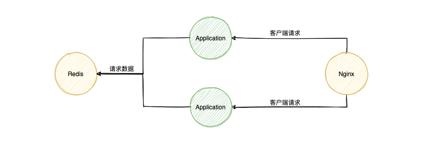
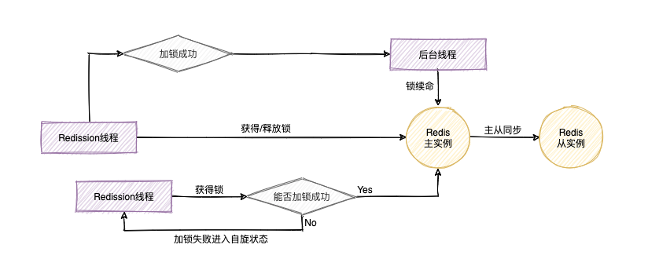

> 本文章迁移自[https://blog.51cto.com/xvjunjie/2428610](https://blog.51cto.com/xvjunjie/2428610), 原站点不再更新。[感谢有你, 一路相伴。](https://blog.51cto.com/xvjunjie/2563261)

众所周知，分布式锁在微服务架构中是重头戏，尤其是在互联网公司，基本上企业内部都会有自己的一套分布式锁开发框架。本文主要介绍使用Redis如何构建高并发分布式锁。假设存在一个SpringBoot的控制器，其扣减库存的业务逻辑如下：

```java
@Autowired
private StringRedisTemplate stringRedisTemplate;

@RequestMapping(value = "/deduct-stock")
public String deductSotck() throws Exception {

    // 将库存取出来
    int i = Interger.parseInt(stringRedisTemplate.opsForValue().get("stock"));

    // 判断库存够不够减
    if (stock > 0) {
        // 将库存回写到redis
        int tmp = stock - 1;
        stringRedisTemplate.opsForValue().set("stock", tmp.toString());
        logger.info("库存扣减成功");
    } else {
        logger.info("库存扣减失败");
    }

    return "finished.";
}
```

不难看出，在应用服务器运行这段代码的时候就会有线程安全性问题。因为多个线程同时去修改Redis服务中的数据。因此考虑给这段代码加上一把锁：

```java
@Autowired
private StringRedisTemplate stringRedisTemplate;

@RequestMapping(value = "/deduct-stock")
public String deductSotck() throws Exception {
    synchronized (this) {
        int i = Interger.parseInt(stringRedisTemplate.opsForValue().get("stock"));

        // 判断库存够不够减
        if (stock > 0) {
            // 将库存回写到redis
            int tmp = stock - 1;
            stringRedisTemplate.opsForValue().set("stock", tmp.toString());
            logger.info("库存扣减成功");
        } else {
            logger.info("库存扣减失败");
        }
    }
    return "finished.";
}
```

这样一来，当多个HTTP请求来请求数据的时候，多个线程去修改同一数据会有JVM本地锁来进行合理的资源限制。虽然这样解决了线程安全性问题，但是这仅仅是JVM级别的锁，在分布式的环境下，由于像这样的Web应用随时会进行动态扩容，因此当多个应用的时候，同样会有线程安全性问题，当上面这段代码遇到类似下面的架构时还是会有各种各样的问题：



对于上述的情况，我们可以使用redis api提供的setnx方法解决：

```java
@Autowired
private StringRedisTemplate stringRedisTemplate;

@RequestMapping(value = "/deduct-stock")
public String deductSotck() throws Exception {

    // 尝试获取锁
    Boolean flag = stringRedisTmplate.opsForValue().setIfAbsent("Hello", "World");

    // 判断是否获得锁
    if (!flag) { return "error"; }

    int i = Interger.parseInt(stringRedisTemplate.opsForValue().get("stock"));

    // 判断库存够不够减
    if (stock > 0) {
        // 将库存回写到redis
        int tmp = stock - 1;
        stringRedisTemplate.opsForValue().set("stock", tmp.toString());
        logger.info("库存扣减成功");
    } else {
        logger.info("库存扣减失败");
    }

    // 删除锁
    stringRedisTemplate.delete("Hello");

    return "finished.";
}
```

`setnx key value`是将key的值设置为value，当且仅当key不存在的时候。如果设置成功就返回1，否则就返回0。

这样的话，首先尝试获取锁，然后当业务执行完成的时候再删除锁。但是还是有问题的，当获取锁的时候抛出异常或者业务执行抛出异常怎么办，所以加入异常处理逻辑：

```java
@Autowired
private StringRedisTemplate stringRedisTemplate;

@RequestMapping(value = "/deduct-stock")
public String deductSotck() throws Exception {
    try {
        // 尝试获取锁
        Boolean flag = stringRedisTmplate.opsForValue().setIfAbsent("Hello", "World");

        // 判断是否获得锁
        if (!flag) { return "error"; }

        int i = Interger.parseInt(stringRedisTemplate.opsForValue().get("stock"));

        // 判断库存够不够减
        if (stock > 0) {
            // 将库存回写到redis
            int tmp = stock - 1;
            stringRedisTemplate.opsForValue().set("stock", tmp.toString());
            logger.info("库存扣减成功");
        } else {
            logger.info("库存扣减失败");
        }
    } finally {
        // 删除锁
        stringRedisTemplate.delete("Hello");
    }
    return "finished.";
}
```

经过这样的修改，看起来没什么问题了。但是当程序获得锁并且开始执行业务逻辑的时候，突然程序挂掉了或者被一些粗暴的运维工程师给kill，在finally中删除锁的逻辑就会得不到执行，因此就会产生死锁。对于这种情况，我们可以给这个锁设置一个超时时间：

```java
@Autowired
private StringRedisTemplate stringRedisTemplate;

@RequestMapping(value = "/deduct-stock")
public String deductSotck() throws Exception {
    try {
        // 尝试获取锁
        Boolean flag = stringRedisTmplate.opsForValue().setIfAbsent("Hello", "World");

        // 设置超时时间, 根据业务场景估计超时时长
        stringRedisTmplate.expire("Hello", 10, TimeUnit.SECONDS);

        // 判断是否获得锁
        if (!flag) { return "error"; }

        int i = Interger.parseInt(stringRedisTemplate.opsForValue().get("stock"));

        // 判断库存够不够减
        if (stock > 0) {
            // 将库存回写到redis
            int tmp = stock - 1;
            stringRedisTemplate.opsForValue().set("stock", tmp.toString());
            logger.info("库存扣减成功");
        } else {
            logger.info("库存扣减失败");
        }
    } finally {
        // 删除锁
        stringRedisTemplate.delete("Hello");
    }
    return "finished.";
}
```

如果程序这么来写，相对来说安全一些了，但是还是存在问题。试想一下，当获取锁成功时，正想给这把锁设置超时的时候，程序挂掉了，还是会出现死锁的，因此在redis较高的版本中提供的setIfAbsent方法中可以同时设置锁的超时时间。

```java
Boolean flag = stringRedisTmplate.opsForValue().setIfAbsent("Hello", "World", 10, TimeUnit.SECONDS);
```

这样一来，尝试获取锁和设置锁的超时时间就具备原子性了。

实际上经过我们这一番改造，这在小型企业已经没有太大的问题， 因为像这种代码每天也就执行几百次，并不算做高并发的场景。当这样的代码被暴露在超高并发场景下的时候，还是会存在各种各样的问题。

试想一个场景，当一个HTTP请求请求到控制器的时候，应用获取到锁了，超时时间也设置成功了，但是应用的业务逻辑超过了超时时间，我们这里的超时时间设置的是10秒，当应用的业务逻辑执行15秒的时候，锁就被redis服务删除了。假设恰好此时又有一个HTTP请求来请求控制器，此时应用服务器会再启动一个线程来获取锁，而且还获取成功了，但是这次的HTTP请求对应的业务逻辑还没有执行完。新来的TTTP请求也在执行，由于新来的HTTP请求也在执行，因为锁超时后被删除，新的HTTP请求也成功获取锁了。当原来的HTTP请求对应的业务逻辑执行完成以后，尝试删除锁，这样正好删除的是新来的HTTP请求对应的锁。这个时候redis中又没有锁了，这样第三个HTTP请求又会获得锁，所以情况就不妙了。

为了解决上面的问题，我们可以将代码优化为下面的样子：

```java
@Autowired
private StringRedisTemplate stringRedisTemplate;

@RequestMapping(value = "/deduct-stock")
public String deductSotck() throws Exception {
    String clientUuid = UUID.randomUUID().toString();
    try {
        // 尝试获取锁,设置超时时间, 根据业务场景估计超时时长
        Boolean flag = stringRedisTmplate.opsForValue().setIfAbsent("Hello", clientUuid, 10, TimeUnit.SECONDS);

        // 判断是否获得锁
        if (!flag) { return "error"; }

        int i = Interger.parseInt(stringRedisTemplate.opsForValue().get("stock"));

        // 判断库存够不够减
        if (stock > 0) {
            // 将库存回写到redis
            int tmp = stock - 1;
            stringRedisTemplate.opsForValue().set("stock", tmp.toString());
            logger.info("库存扣减成功");
        } else {
            logger.info("库存扣减失败");
        }
    } finally {
        // 删除锁的时候判断是不是自己的锁
        if (clientUuid.equals(stringRedisTemplate.opsForValue().get("Hello"))) {
            stringRedisTemplate.delete("Hello");   
        }
    }
    return "finished.";
}
```

但是由于程序的不可预知性，谁也不能保证极端情况下，同时会有多个线程同时执行这段业务逻辑。我们可以在当执行业务逻辑的时候同时开一个定时器线程，每隔几秒就重新将这把锁设置为10秒，也就是给这把锁进行“续命”。这样就用担心业务逻辑到底执行多长时间了。但是这样程序的复杂性就会增加，每个业务逻辑都要写好多的代码，因此这里推荐在分布式环境下使用redisson。因此我们使用redisson实现分支线程的代码：

- 引入依赖：

```xml
<dependency>
    <groupId>org.redisson</groupId>
    <artifactId>redisson</artifactId>
    <version>3.6.5</version>
</dependency>
```

- 初始化Redisson的客户端配置：

```java
@Bean
public Redisson redisson () {
    Config cfg = new Config();
    cfg.useSingleServer().setAddress("redis://localhost:6379").setDatabase(0);
    return (Redisson) Redisson.create(cfg);
}
```

- 在程序中注入Redisson客户端：

```java
@Autowired
private Redisson redisson;
```

- 对应的业务逻辑：

```java
@Autowired
private StringRedisTemplate stringRedisTemplate;

@RequestMapping(value = "/deduct-stock")
public String deductSotck() throws Exception {
    // 获取锁对象
    RLock lock = redisson.getLock("Hello");
    try {
        // 尝试加锁, 默认30秒, 自动后台开一个线程实现锁的续命
        lock.tryLock();

        int i = Interger.parseInt(stringRedisTemplate.opsForValue().get("stock"));

        // 判断库存够不够减
        if (stock > 0) {
            // 将库存回写到redis
            int tmp = stock - 1;
            stringRedisTemplate.opsForValue().set("stock", tmp.toString());
            logger.info("库存扣减成功");
        } else {
            logger.info("库存扣减失败");
        }
    } finally {
        // 释放锁
        lock.unlock();
    }
    return "finished.";
}
```

Redisson分布式锁的实现原理如下：



但是这个架构还是存在问题的，因为redis服务器是主从的架构，当在master节点设置锁之后，slave节点会立刻同步。但是如果刚在master节点设置上了锁，slave节点还没来得及设置，master节点就挂掉了。还是会产生上同样的问题，新的线程获得锁。

**因此使用redis构建高并发的分布式锁，仅适合单机架构，当使用主从架构的redis时还是会出现线程安全性问题。**
